# CardanoPress Bootstrap Theme

For anyone wanting to have a clean starter theme that will work with the Cardano serialisation library and the
CardanoPress plugin. This is a perfect starting point for any dApp website integrating with Cardano.

## Installation
1) Download the theme from the repository here
2) From the admin area of WordPress, click Appearances > Themes
3) Click UPLOAD theme
4) Find the theme on your computer and upload it to your WordPress website
5) Enable and activate the theme

It is recommended that you now also create and configure a child theme to go along with this parent theme which will
contain all of your customisations for the websites styles.

## Support
Join us on Discord to learn more about the project and get support on integrations. https://discord.gg/CEX4aSfkXF

Support the development of our plugin by delegating to our Stake pool Ticker: ADAOZ - https://cardanode.com.au.

> Full example of overridden templates

## Connect modal

## Dashboard page

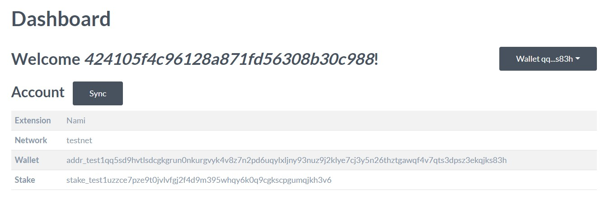

## Dropdown menu

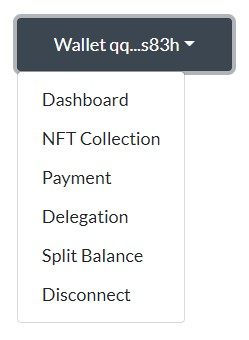

## Assets collection

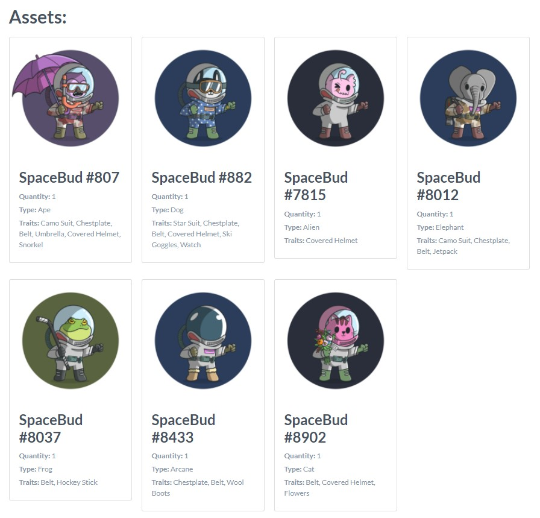

## Payment flow

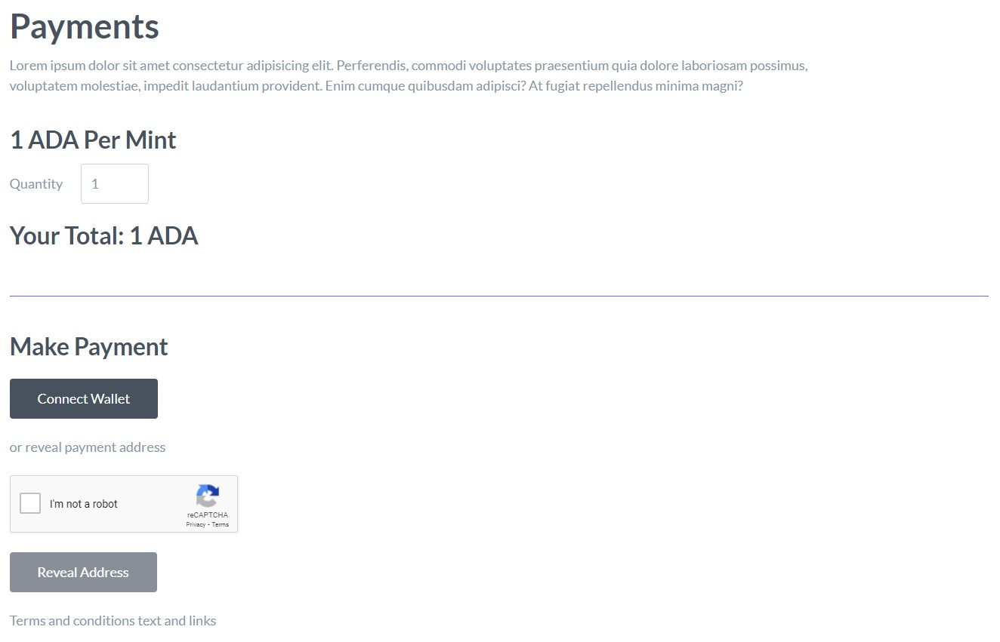

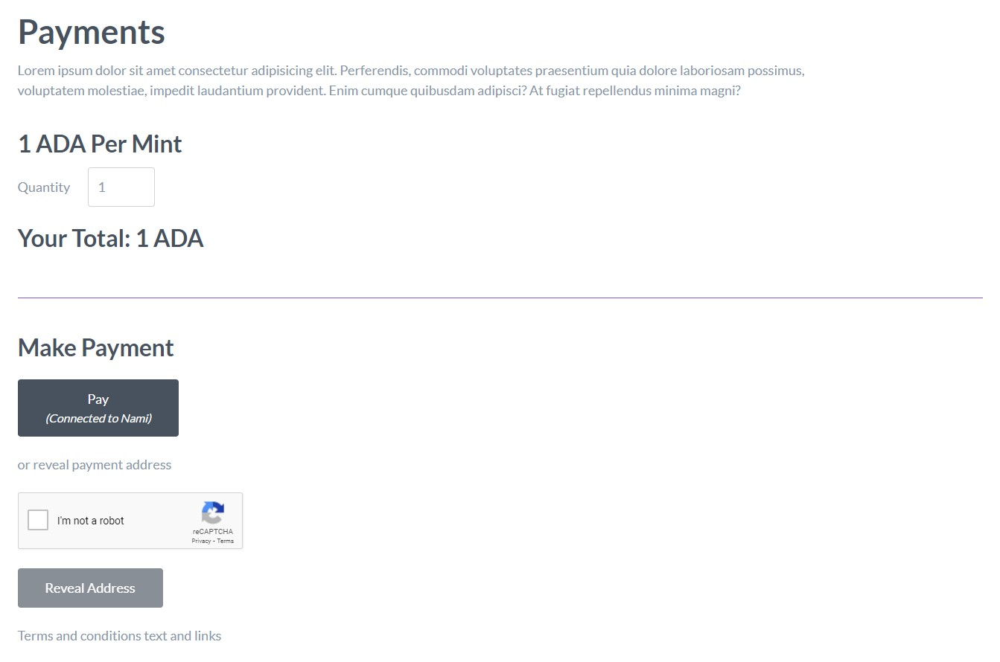

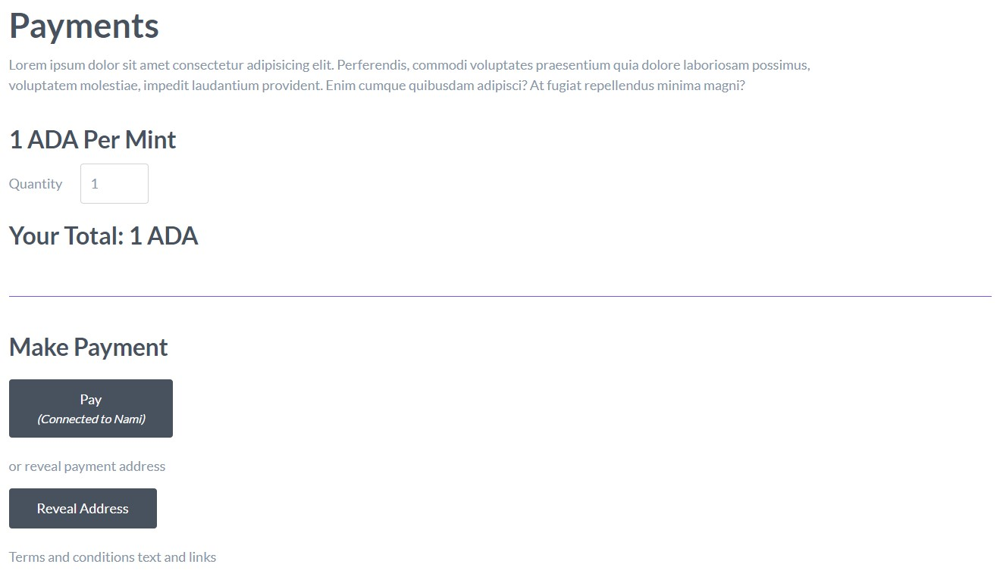

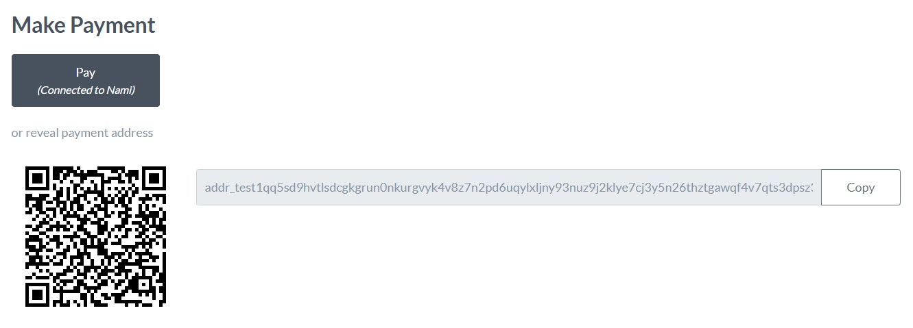

## Delegation flow

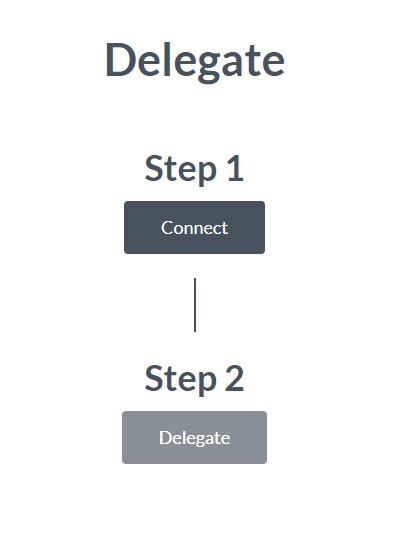

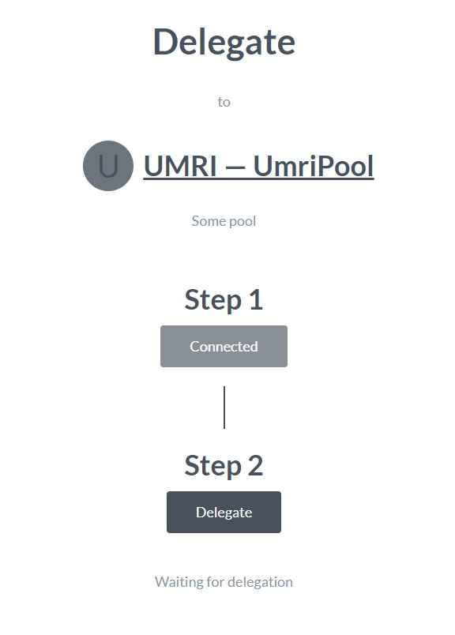

## Split payments

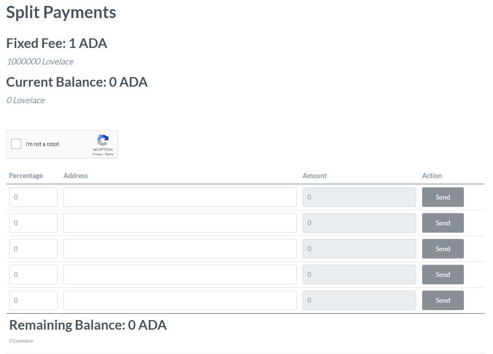

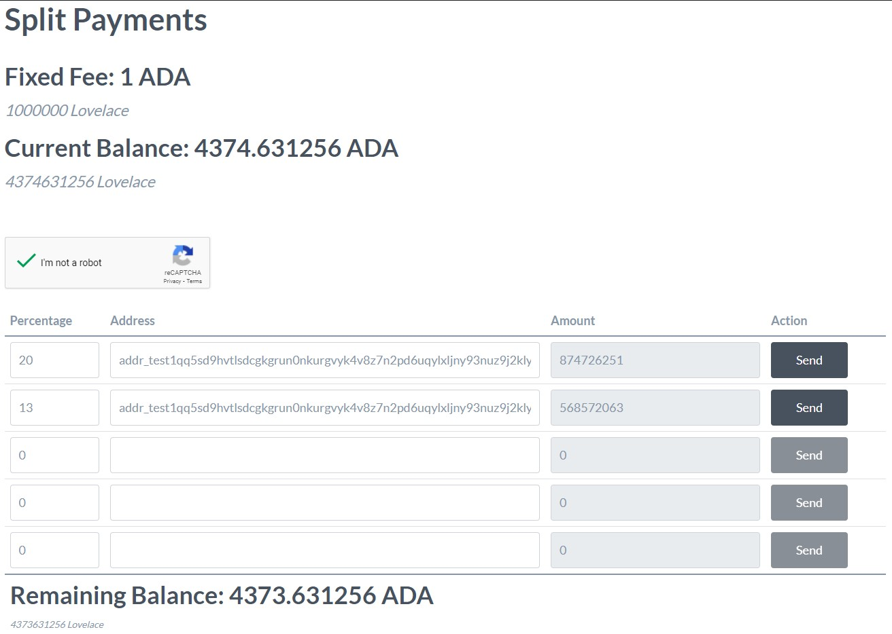
