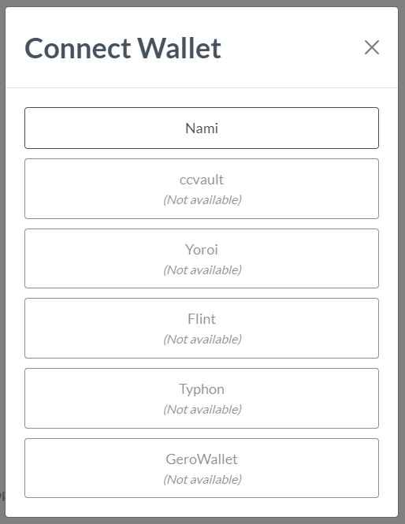

# CardanoPress Bootstrap

> Full example of overridden templates

## Connect modal

## Dashboard page

## Dropdown menu

## Assets collection

## Payment flow

## Delegation flow

## Split payments

